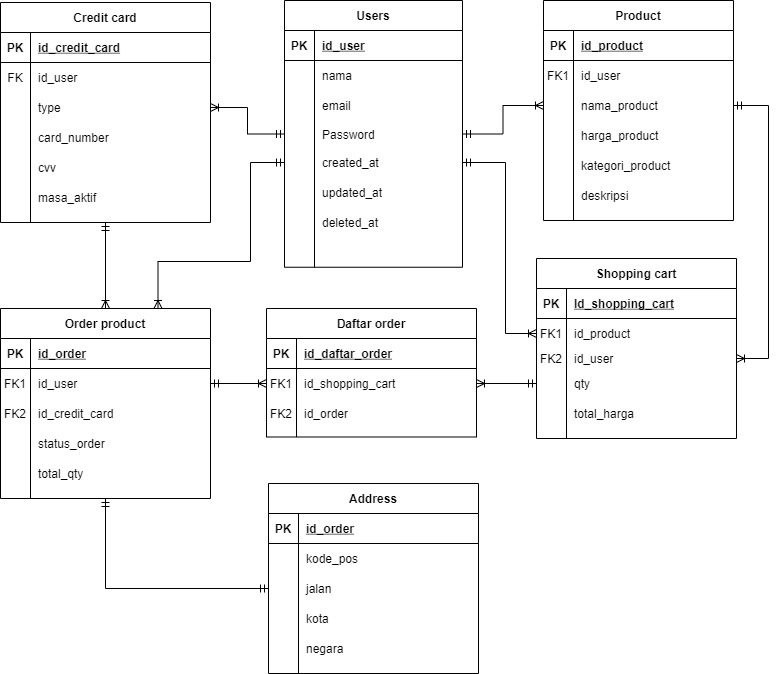

<!--
*** Thanks for checking out the Best-README-Template. If you have a suggestion
*** that would make this better, please fork the repo and create a pull request
*** or simply open an issue with the tag "enhancement".
*** Don't forget to give the project a star!
*** Thanks again! Now go create something AMAZING! :D
-->

<!-- PROJECT SHIELDS -->
<!--
*** I'm using markdown "reference style" links for readability.
*** Reference links are enclosed in brackets [ ] instead of parentheses ( ).
*** See the bottom of this document for the declaration of the reference variables
*** for contributors-url, forks-url, etc. This is an optional, concise syntax you may use.
*** https://www.markdownguide.org/basic-syntax/#reference-style-links
-->

<!-- PROJECT LOGO -->
 

<!--  mengarah ke repo  -->
  

  <h3 align="center">Project E-Commerce</h3>

  

    Project E-Commerce Alta Store Program Immersive Back End Batch 4
     
    <a href="https://github.com/NurilH/project1-alta-be4"><strong>Explore the docs »</strong></a>
     
  

<!-- TABLE OF CONTENTS -->

  
Daftar Isi

  <ul>
    <li>
      <a href="#about-the-project">About The Project</a>
    </li>
    <li><a href="#built-with">Built With</a></li>
    <li>
      <a href="#erd">ERD</a>
    </li>
    <li><a href="#contact">Contact</a></li>
  </ul>

<!-- ABOUT THE PROJECT -->
## About The Project

<!-- [![Product Name Screen Shot][product-screenshot]](https://example.com) -->

E-Commerce Alta Store merupakan aplikasi yang digunakan untuk transaksi produk secara online.
Berikut merupakan fitur yang terdapat dalam e-commerce alta store :

      <ul>
        <li><h5>Users</h5></li>
        
Users dapat melakukan Create, Read, Update, Delete (CRUD) pada data user.
         User yang telah melakukan registrasi (create) dapat melakukan login.

        <li><h5>Products</h5></a></li>
        
Users dapat melakukan Create, Read, Update, Delete (CRUD) pada data product.
         Fitur Update dan Delete hanya dapat dilakukan pada produk miliknya sendiri.
         User dapat melihat semua data product termasuk product yang dimilikinya sendiri.

        <li><h5>Cart</h5></a></li>
        
Users dapat melakukan Create, Read, Update, Delete (CRUD) pada data Cart.

        <li><h5>Order</h5></a></li>
        
Users dapat melakukan order product yang ada pada cart.
         Users dapat melihat history order dan cancel order.

      </ul>

(<a href="#top">back to top</a>)

### Built With

* [Golang](https://golang.org/)
* [Echo Framework](https://echo.labstack.com/)
* [MySQL](https://www.mysql.com/)
* [Gorm](https://gorm.io/)
* [JWT](https://echo.labstack.com/cookbook/jwt)
* [Assert](https://pkg.go.dev/github.com/stretchr/testify/assert)
* [VS Code](https://code.visualstudio.com/)

(<a href="#top">back to top</a>)

<!-- ERD -->
## ERD

<!-- CONTACT -->
## Contact

Project Link: [https://github.com/NurilH/project1-alta-be4](https://github.com/NurilH/project1-alta-be4)
<!-- :heart: -->
<!-- CONTRIBUTOR -->
Contributor :
 

 
Mentor :
 
<!-- https://www.linkedin.com/in/iffakhry/ -->

(<a href="#top">back to top</a>)

<h3>

:copyright: 2021 | Built with :heart: from us

</h3>